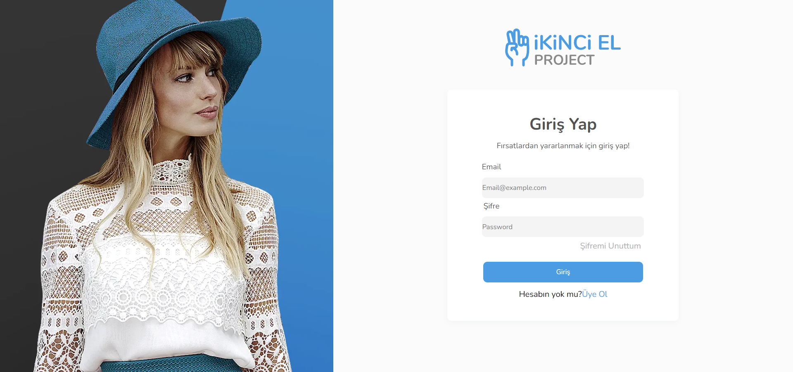
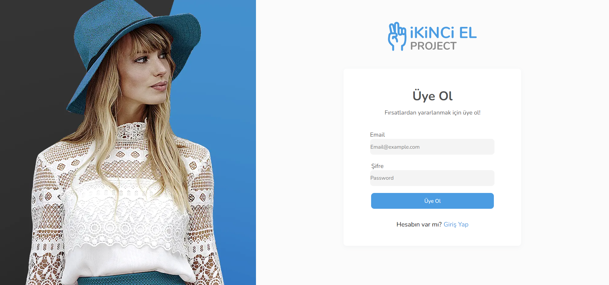
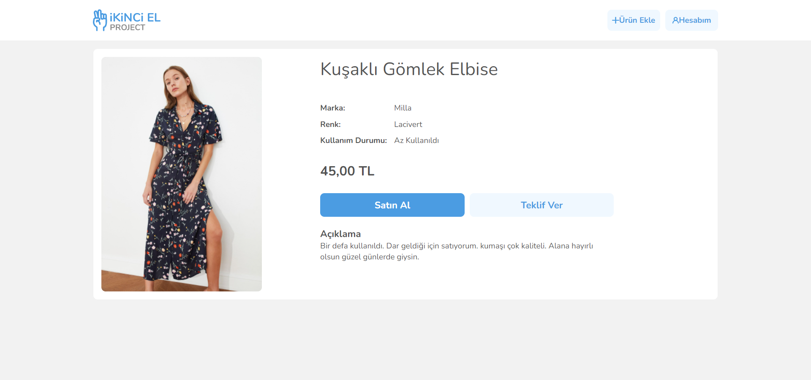

### 2nd-hand-project

Built with React, Next.js, Context-API, axios, Sass, and Toastify. It is a second-hand application according to the given designs.

### Scope and Process of the Project

The scope of the project consists of user login page, user registration page, home page, product detail page, product purchasing and bidding my account page and product adding pages.

I met with Next.js 2 weeks ago and thought it would gain experience to build the project with a structure I just learned. Of course, I faced many problems because I had no experience.
Because I like to research, I started to solve the problems I encountered, albeit slowly.
In this process so far
It consists of homepage, product detail page, login page and registration page. I will add purchasing and bidding notifications to the detail page. I will add product add page and add my account page. I will continue to develop these pages.

The live version of the project is the link here <a href="https://2nd-hand-project.vercel.app/" target="_blank">Click</a> 

## Installation and Setup Instructions

Clone down this repository. You will need `node`, `npm` and `yarn` installed globally on your machine.  

Installation:

`npm`  

To Run Test Suite:  

`npm test`  

To Start Server:

`start`: `npm run dev`

To Visit App:

`localhost:3000/`  

### LOGİN PAGE

### REGİSTER PAGE

### HOME PAGE

### DETAİL PAGE

